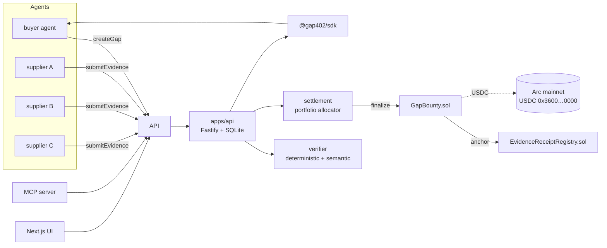

# Gap402

**The missing-knowledge market for AI agents.**

> When an AI agent cannot find the answer, it creates a market for one.

Most agent marketplaces are supply-driven: a provider lists an API, an agent
buys a call. Gap402 reverses the direction — an agent that hits an evidence
wall converts the unsupported claim into a machine-readable, USDC-funded
bounty on Arc, lets competing evidence suppliers fill it, settles them with
a deterministic portfolio allocation, and walks away with a cryptographic
Evidence Receipt.

```text
question
  -> agent researches
  -> evidence insufficiency detected
  -> Gap402 bounty created (USDC escrowed on Arc)
  -> evidence suppliers discover + submit
  -> verifier evaluates (deterministic checks, optional semantic review)
  -> portfolio settlement splits the bounty
  -> Evidence Receipt anchored onchain
  -> buyer consumes the evidence and continues reasoning
```

## Quickstart

**[Open the public demo](https://gap402.tangvu.dev)** — interactive sandbox with
synthetic evidence and zero actual spend. The separate
[Arc mainnet run](https://gap402.tangvu.dev/mainnet) shows a settled bounty,
explorer transactions, and a portable proof.
See [self-hosting operations](docs/self-hosting.md) for the PM2/Cloudflare setup.

Prereqs: Node 22+, pnpm 11+, and Arc Foundry (`arc-anvil`, `arc-forge`)
for local chain emulation and contract tests.

```bash
pnpm install

# terminal 1 — local Arc emulation (USDC at 0x3600…0000, 6-decimal interface)
arc-anvil --network arc --port 8545

# terminal 2 — the full end-to-end demo:
# question -> gap -> funded bounty -> 3 supplier agents -> verify ->
# portfolio settlement onchain -> receipt anchored -> buyer consumes
pnpm demo
```

Then explore:

Open `/lab` for the interactive evidence walkthrough (isolated simulation,
no wallet or spend), and `/verify` to inspect a portable proof in your browser.
Receipt pages export the original bounty, payout plan and receipt together.
See [cross-team winner research](docs/winner-research.md) for the sources and
implementation decisions behind these improvements, and the
[verification record](docs/verification-2026-09-22.md) for executed checks and limits.

```bash
# API + web UI
pnpm --filter @gap402/api start     # http://127.0.0.1:4020
pnpm --filter @gap402/web dev       # http://127.0.0.1:3000

# CLI
pnpm --filter @gap402/cli gap402 doctor
pnpm --filter @gap402/cli gap402 gap list
pnpm --filter @gap402/cli gap402 receipt verify <receipt-id>
```

## What is real vs simulated

| Component | Status |
| --- | --- |
| USDC escrow, payouts, receipt anchoring | Real EVM transactions on `arc-anvil --network arc` (same USDC interface address as mainnet) |
| Settlement math | Deterministic, `bigint`, exact-sum invariant, property-tested |
| Evidence verification | Deterministic checks always; optional OpenAI-compatible semantic review via env |
| Demo evidence sources | **Simulated fixtures, labelled as such** — swap `SourceProvider` for real web fetches |
| `pnpm demo:mainnet` | Real Arc mainnet path, guarded by `MAINNET_ENABLED` + `DEMO_CONFIRM` + spend caps |

## Architecture



```text
apps/      api (Fastify+SQLite) · cli (gap402) · mcp (MCP server) · web (Next.js)
packages/  config (Arc networks) · schemas (zod domain model) · protocol
           (canonical hashing) · settlement (portfolio allocator)
           · evidence (URL/content utils) · verifier · sdk (client + chain)
contracts/ GapBounty.sol + EvidenceReceiptRegistry.sol (arc-forge tests)
examples/  autonomous-buyer · evidence-supplier · keryx-adapter · mcp-client
scripts/   demo.ts · demo-mainnet.ts · deploy.ts · build-abi.ts
```

## Arc integration

Verified against <https://docs.arc.io> (mainnet launch 2026-09-16):

| | mainnet | testnet | local |
| --- | --- | --- | --- |
| chain ID | `5042` | `5042002` | `31337` (arc-anvil) |
| RPC | `https://rpc.mainnet.arc.io` | `https://rpc.testnet.arc.io` | `http://127.0.0.1:8545` |
| explorer | `https://explorer.arc.io` | `https://explorer.testnet.arc.io` | — |
| USDC (ERC-20, 6dp) | `0x3600000000000000000000000000000000000000` | same | same (emulated) |
| native USDC (gas, 18dp) | yes | yes | yes |

Arc shares one USDC balance between the native (18-decimal, gas) and ERC-20
(6-decimal, application) interfaces. All Gap402 accounting uses **6-decimal
ERC-20 base units as integer `bigint`** — never floats, never mixed units.

Network selection is env-driven and fails closed:

```bash
GAP402_NETWORK=local|testnet|mainnet   # default: local
MAINNET_ENABLED=true                    # required for mainnet
PRIVATE_KEY=0x…                         # requester key (never committed)
VERIFIER_PRIVATE_KEY=0x…                # verifier key
GAP_BOUNTY_ADDRESS=0x…                  # deployed contract
```

Every transaction path calls `verifyNetwork()` first: if the RPC reports a
different chain ID than configured, the request aborts. Mainnet mode cannot
silently land on testnet.

## SDK

```ts
import { Gap402 } from "@gap402/sdk";

const gap = new Gap402({
  api: "http://127.0.0.1:4020",
  requester: { id: "my-agent", kind: "service", address: "0x…" },
});

const bounty = await gap.createGap({
  question: "Has Acme Corp deployed WidgetNet in Vietnam?",
  claim: "Acme Corp deployed WidgetNet in Vietnam before 2026-09-01",
  requirements: { maxSourceAgeSeconds: 2592000, minSupportScore: 600000 },
  budget: "0.05",           // USDC — human units in, bigint units out
  deadlineSeconds: 3600,
});

const settled = await gap.waitForEvidence(bounty.gap.id);
const receipt = await gap.getReceiptByBounty(bounty.gap.id);
```

## Settlement: evidence portfolios, not winner-takes-all

`packages/settlement` computes `quality_i = support · provenance ·
independence · novelty · freshness` (fixed-point, `SCORE_SCALE = 1e6`),
normalizes across qualifying submissions aggregated per recipient, applies a
verifier fee, a max-share cap, and a minimum-payout floor, redistributes
deterministically (largest remainder, stable tie-breaks), and refunds any
residue. Invariant, enforced and property-tested:

```text
sum(payouts) + refund == bounty        // exact, integer, always
```

Every payout carries an `explanation` — the UI answers "why did this
evidence receive 0.019614 USDC?".

## Evidence Receipt

```json
{
  "protocol": "gap402",
  "version": "1",
  "bountyId": "gap_…",
  "requestHash": "0x…",
  "targetClaim": "…",
  "acceptedEvidence": [{ "url", "contentHash", "supplierAddress", "scores", "payoutUnits" }],
  "rejectedEvidence": [{ "url", "reasons" }],
  "totalPaidUnits": "…",
  "settlementHash": "0x…",
  "receiptHash": "0x…",       // anchored in EvidenceReceiptRegistry
  "evaluatorVersion": "gap402-verifier-1.0.0"
}
```

`gap402 receipt verify <id|file.json>` recomputes the canonical hash,
validates the schema, checks payout consistency, and optionally queries the
onchain registry — a judge never has to trust this repo's API.

## Contracts

Two small immutable contracts (`contracts/src`):

- **`GapBounty.sol`** — requester escrows USDC; suppliers commit evidence
  hashes (dup-safe, capped, deadline-enforced); the designated verifier
  finalizes with a payout vector the contract validates exactly
  (`sum == escrowed`, sorted recipients, no zero entries) while anchoring
  `settlementHash` + `receiptHash`. Reentrancy-guarded, custom errors,
  `cancel()` refunds the requester after deadline.
- **`EvidenceReceiptRegistry.sol`** — minimal anchored-hash registry; only
  the bound `GapBounty` writes.

23 Foundry tests, including fuzz/property cases, run against Arc-emulating
`arc-anvil` semantics (`arc-forge test --network arc`).

## MCP

```bash
pnpm --filter @gap402/mcp start        # stdio server
pnpm --filter @gap402/example-mcp-client start
```

Tools: `gap402_create_gap`, `gap402_get_gap`, `gap402_search_open_gaps`,
`gap402_submit_evidence`, `gap402_get_receipt`, `gap402_cancel_gap`,
`gap402_get_proof`. Non-local writes require `GAP402_WRITE_TOKEN` on the server
and CLI/MCP; SDK callers pass `writeToken`. See the deployment runbook.

## Tests

```bash
pnpm test                # vitest across packages (incl. API + settlement)
pnpm test:contracts      # 23 forge tests on Arc semantics
pnpm typecheck           # strict TS, all packages
pnpm build               # tsc builds + next build
pnpm lint                # prettier --check
```

## Deployment

See [docs/deployment.md](docs/deployment.md). TL;DR:

```bash
# local
arc-anvil --network arc & pnpm deploy

# testnet
GAP402_NETWORK=testnet PRIVATE_KEY=0x… pnpm deploy

# mainnet (deliberate, gated)
GAP402_NETWORK=mainnet MAINNET_ENABLED=true PRIVATE_KEY=0x… pnpm deploy
MAINNET_ENABLED=true DEMO_CONFIRM=YES DEMO_MAX_USDC=0.10 \
  GAP_BOUNTY_ADDRESS=0x… pnpm demo:mainnet
```

Deployment addresses land in `deployments/<network>.json`. Gap402 is deployed
and settled on Arc mainnet; see [the transaction record](docs/arc-microgrant.md).

## Docs

- [docs/protocol.md](docs/protocol.md) — domain model, hashing, settlement spec
- [docs/architecture.md](docs/architecture.md) — components and data flow
- [docs/security.md](docs/security.md) — threat model and controls
- [docs/demo-script.md](docs/demo-script.md) — 90-second narrated demo
- [docs/arc-microgrant.md](docs/arc-microgrant.md) — submission copy
- [CONTRIBUTING.md](CONTRIBUTING.md) · [SECURITY.md](SECURITY.md) · [LICENSE](LICENSE) (MIT)

## Roadmap

- Real-time supplier indexing + WebSocket market feed
- Multi-claim bounties and partial-coverage pricing
- ERC-8004 agent identity attestations for suppliers
- Reputation-weighted verifier selection
- x402-style per-call evidence pricing alongside bounty markets
