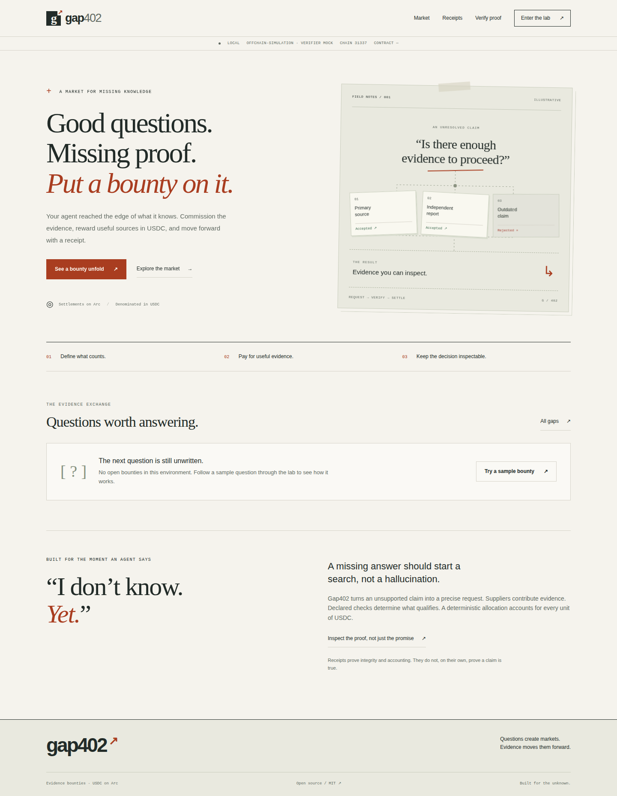
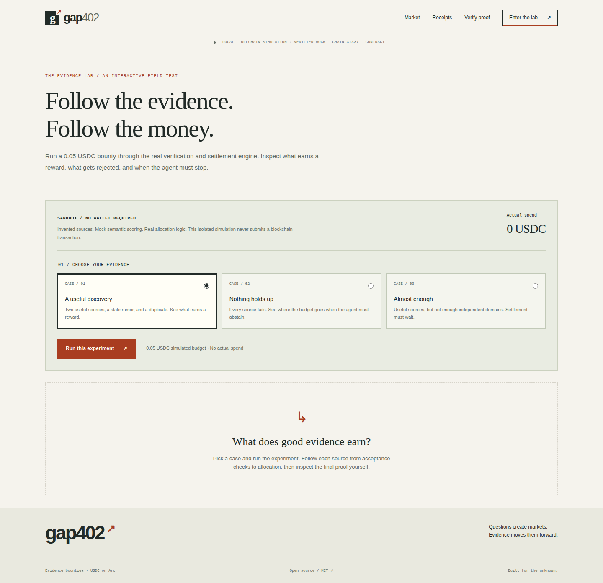

# Frontend direction: the evidence desk

Gap402's interface treats a bounty as a research dossier: a question, a collection
of sources, a decision, and an accountable payment. The home-page illustration is
custom SVG/CSS, explicitly illustrative rather than a fabricated live market.

## Design system

- Warm paper (`#f5f3ed`), dark ink (`#222b28`), and restrained oxide orange
  (`#a93d20`). Green and red communicate verification outcomes with text labels.
- Georgia for editorial headlines; system sans-serif for reading and controls;
  monospace for identifiers, amounts and field labels. No external font request.
- Thin rules, square controls, generous margins and a deliberately asymmetric
  cover. The source dossier supplies the visual identity rather than a stock image.
- One main action per view. Market, receipts, proof verification and the lab share
  navigation, active states, typography, diagrams and environment labels.

## Interaction changes

- Three native radio-card scenarios explain their consequences before a lab run.
  Pending and failed requests provide feedback; results scroll into view after a
  completed experiment, respecting reduced-motion preferences.
- Simulated budget and actual spend stay distinct. New result summaries make a
  blocked settlement visible before users inspect individual source checks.
- On narrow screens, lab payout rows become labeled entries, preserving the
  recipient, amount and reason without horizontal scrolling.
- Proofs can be opened from local JSON files (up to 1 MB), pasted, checked and
  downloaded. Changing input clears stale results/errors. Empty input cannot be
  submitted. File contents are never uploaded.
- Empty market/archive states provide a next action. Loading, unavailable and
  missing-record states have separate treatments. Receipt API errors are no
  longer silently presented as an empty archive.
- Visible keyboard focus, a skip link, native fieldsets, live status feedback and
  reduced motion are built into the UI. Desktop and mobile use the same content.

The redesign changes the frontend experience, not settlement policy or verifier
capabilities. Source fixtures remain synthetic; a valid offline proof is an
integrity result, not factual or onchain authentication.

## Executed verification — 22 September 2026

- `pnpm lint`: passed.
- `pnpm --filter @gap402/web build`: passed, including TypeScript validation and
  production route generation. No application dependency was added.
- Playwright Chromium against the production server: **32/32 assertions passed**,
  with zero page JavaScript errors. Checked five routes at 320, 390, 768 and 1440px;
  no page overflow. Ran all three lab scenarios, local proof file import, valid
  verification, tampered proof rejection, invalid JSON, simulated API failure and
  retry availability, keyboard skip-link focus and navigation.
- Axe WCAG 2 A/AA and 2.1 AA scan: zero detected violations on home, lab, verifier,
  market and receipts. This automated result does not establish full accessibility
  conformance. Browser assertions and scan results are stored alongside this file.
- Inspected actual desktop/mobile screenshots. Chromium ran headlessly in WSL;
  the native browser connector still had no available surface. No Safari/Firefox
  or physical-device run was performed.
- Backend and contracts were unchanged; the previous backend verification record
  remains separate. The preview and lab do not represent a mainnet deployment.

